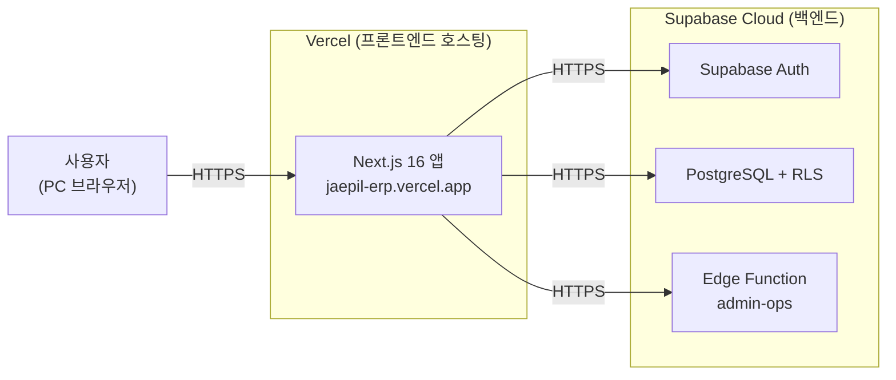

# 배포 현황 보고 (Deployment Status)

> **대상**: 사내 ERP — 인증·인사 모듈 (MVP)
> **보고일**: 2026-05-31
> **상태**: ✅ 배포 완료 · 정상 동작 확인

---

## 1. 배포 개요

사내 ERP의 **인증·인사 모듈(MVP)**을 클라우드에 배포 완료했습니다. 별도 서버 구축 없이, 화면(프론트엔드)은 **Vercel**에, 인증·데이터·서버로직(백엔드)은 **Supabase Cloud**에 올라가 있으며, 웹 브라우저로 바로 접속해 사용·검증할 수 있는 상태입니다.

| 구분 | 배포 위치 | 비고 |
|------|----------|------|
| 프론트엔드(화면) | **Vercel** | 자동 SSL(HTTPS)·CDN 적용 |
| 백엔드(인증·DB·서버로직) | **Supabase Cloud** (도쿄 리전) | 자동 백업 |

---

## 2. 접속 정보

| 항목 | 내용 |
|------|------|
| **접속 주소(URL)** | **https://jaepil-erp.vercel.app** |
| 접속 환경 | PC 웹 브라우저 (Chrome, Edge, Safari 등) |
| 로그인 방법 | 사번 + 비밀번호 |
| 통신 보안 | HTTPS 암호화 |

> 위 주소로 접속하면 로그인 화면이 표시됩니다.
