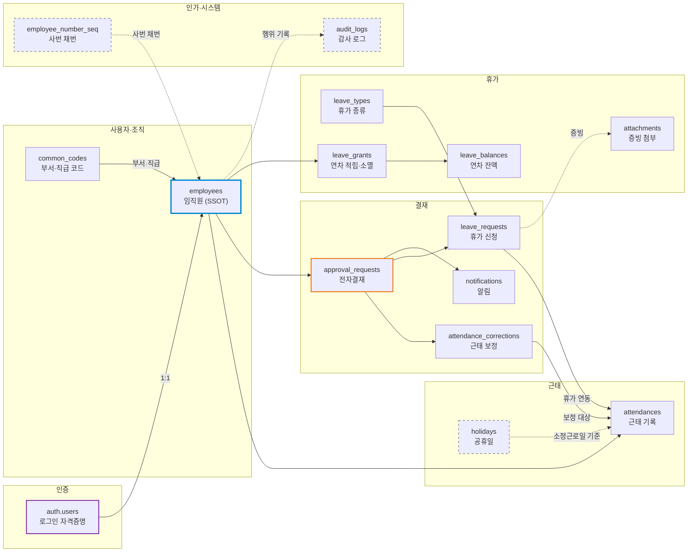
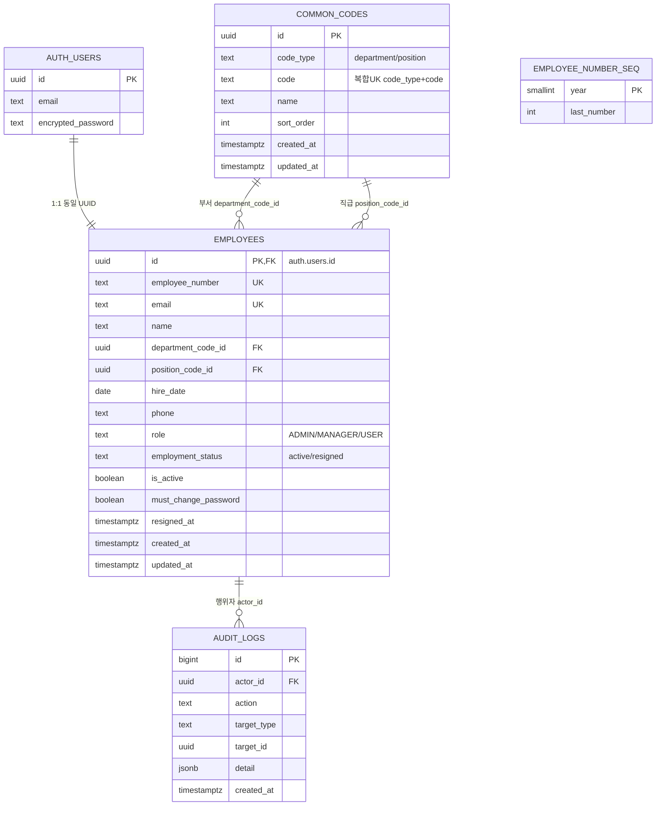
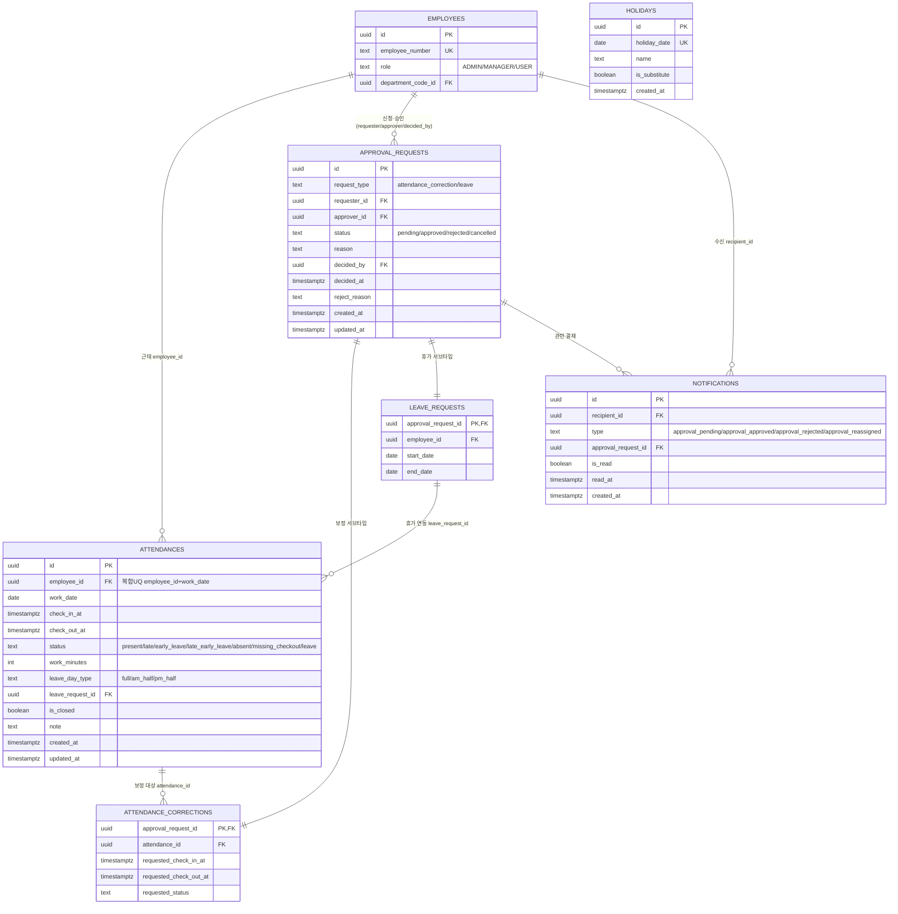
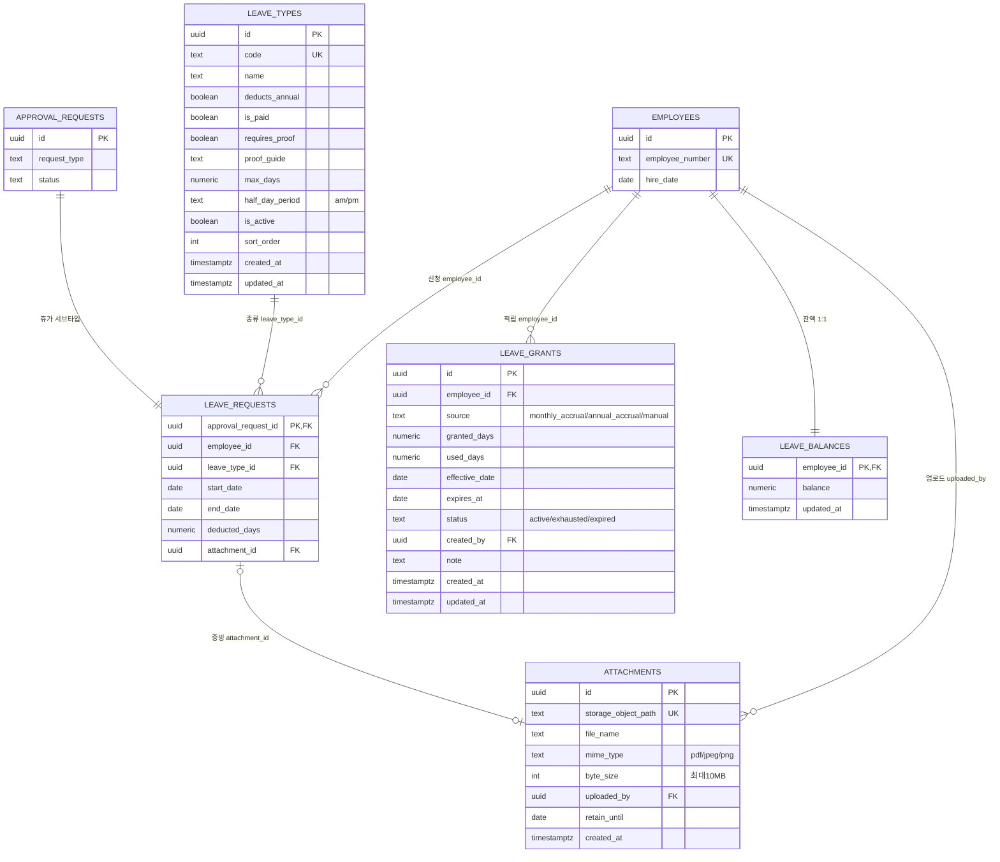
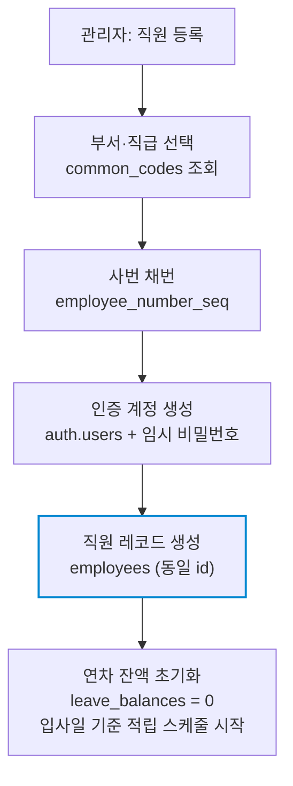
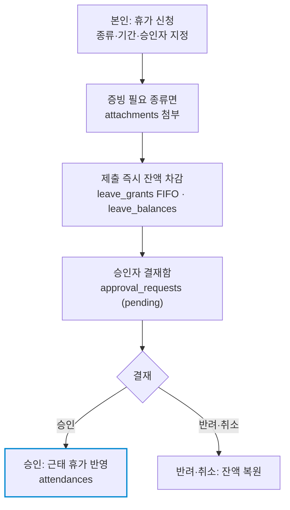
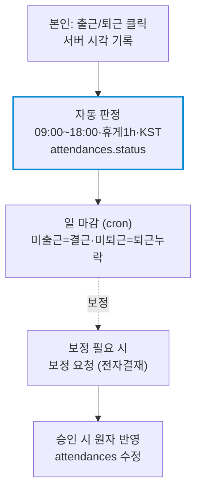
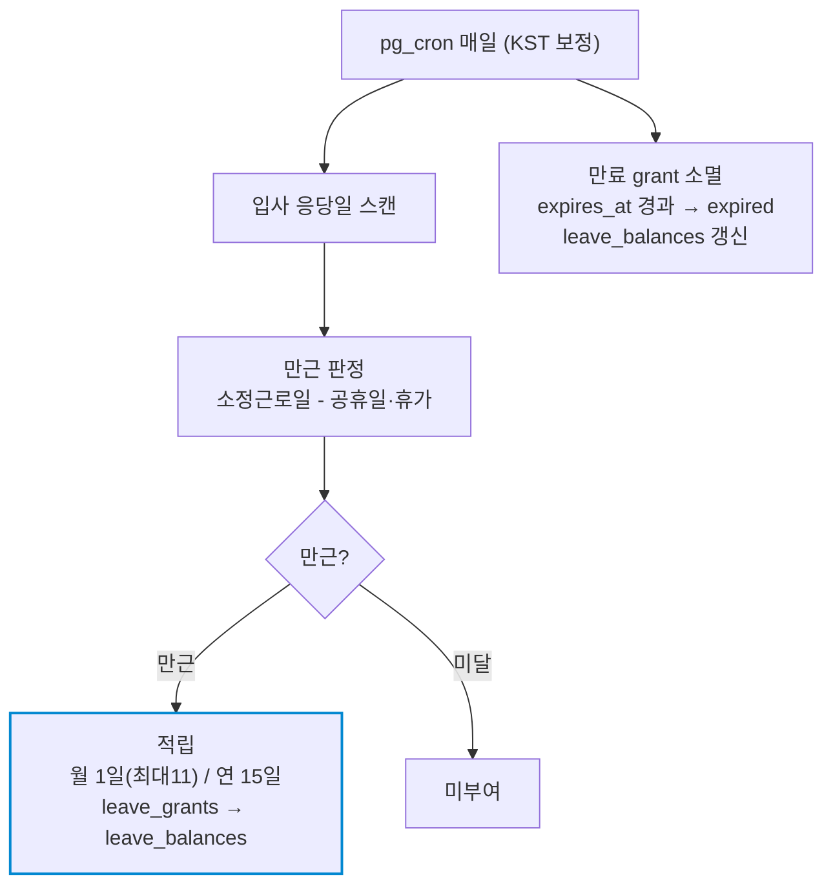

# 데이터베이스 ERD (Entity-Relationship Diagram)

> **대상**: 사내 ERP — 인증·인사·근태·휴가 모듈
> **대상 DBMS**: PostgreSQL 17 (Supabase)
> **작성일**: 2026-05-30
> **개정일**: 2026-06-03 (근태·결재·휴가·감사·알림 도메인 15개 테이블 반영)

본 문서는 데이터 모델의 구조를 3개 관점(도메인 분류도·전체 ERD·데이터 흐름)으로 시각화하고 핵심 설계 원칙을 정리한다. 테이블·컬럼 상세 명세는 database.md를 단일 출처로 참조한다. 전체 15개 테이블이 6개 도메인(인증·사용자/조직·근태·결재·휴가·인가/시스템)으로 구성되며, **employees가 모든 영역의 중심축**이고 auth.users(인증)와 1:1로 연결된다.

---

## 1. 도메인 분류도

15개 테이블을 6개 영역으로 그룹화하여 전체 윤곽을 보여준다. 거의 모든 관계가 employees로 모인다.

| 테두리 | 의미 |
|--------|------|
| 파란 굵은 선 (employees) | 모든 영역의 중심축 — 인사·계정·근태·휴가의 단일 진실 공급원(SSOT) |
| 보라 선 (auth.users) | 인증 영역 — Supabase가 관리, employees와 1:1 |
| 주황 선 (approval_requests) | 공통 전자결재 슈퍼타입 — 근태 보정·휴가가 서브타입으로 연결 |
| 회색 점선 (employee_number_seq·holidays·audit_logs) | 직접 FK 없이 함수·판정·기록에 참조되는 보조 테이블 |

---

## 2. 전체 ERD

도메인별로 3개 다이어그램으로 나눠 표기한다. 교차 도메인 FK는 참조 엔티티(핵심 컬럼만)로 연결하며, 컬럼 상세는 database.md를 참조한다.

### 2-1. 인증·인사 코어

> employee_number_seq는 FK 없는 독립 채번 카운터다. audit_logs는 전 도메인의 주요 변경을 기록하는 append-only 테이블로 actor_id로 employees를 참조한다(시스템 자동 변경은 NULL).

### 2-2. 근태·결재

> EMPLOYEES·LEAVE_REQUESTS는 참조 엔티티다(전체 컬럼은 2-1·2-3). approval_requests↔employees는 requester_id·approver_id·decided_by 3개 FK이며 다이어그램은 대표 1선으로 표기한다. holidays는 FK 없는 독립 테이블로 근태 자동판정·만근 판정의 소정근로일 산출 기준이다.

### 2-3. 휴가·연차

> EMPLOYEES·APPROVAL_REQUESTS는 참조 엔티티다(전체 컬럼은 2-1·2-2). leave_requests.attachment_id ↔ attachments는 단방향 1:1(증빙 1건, 역방향 FK 없음 — 순환 제거). leave_balances는 leave_grants 원장의 잔액 요약(역정규화)이다.

---

## 3. 데이터 흐름

### 3-1. 직원 등록

직원 등록 한 번에 인증 계정·인사 프로필·사번·연차 잔액이 함께 생성된다.

1. 부서·직급을 common_codes에서 선택
2. employee_number_seq로 입사연도 기준 사번 자동 채번 (예: 2026-0001)
3. auth.users에 인증 계정 + 임시 비밀번호 생성
4. 동일 id로 employees 레코드 생성, leave_balances 0 초기화 — 트랜잭션으로 원자 처리

### 3-2. 휴가 신청 → 결재 → 잔액 정산 → 근태 연동

> 차감/복원은 트리거 `settle_leave_balance`가 원자 처리(LEAVE-10). 승인 후에도 휴가 시작일 이전이면 취소 가능·잔액 자동 환원(LEAVE-7).

### 3-3. 근태 출퇴근 → 자동판정 · 보정

> 근태 직접 수정은 차단되고 보정은 `attendance_corrections → approval_requests → 승인` 경로로만(ATT-7·9).

### 3-4. 연차 자동 적립 · 소멸 (pg_cron)

> 적립은 각 판정 시점 확정 근태 기준이며 사후 보정을 소급하지 않는다(LEAVE-3·4·5).

---

## 4. 핵심 설계 원칙

| # | 원칙 | 효과 |
|---|------|------|
| 1 | employees를 단일 진실 공급원(SSOT)으로 운용 | 인사·계정·근태·휴가가 employees.id로 일관 식별 |
| 2 | 인증을 auth.users로 위임 (1:1) | 비밀번호·세션을 Supabase가 관리, 애플리케이션 부담 최소화 |
| 3 | 부서·직급을 단일 common_codes로 정규화 | code_type으로 유형 구분, 코드 추가·변경이 employees에 영향 없음 |
| 4 | 재직상태(employment_status)와 계정활성(is_active) 분리 | 일시 비활성(재활성 가능)과 퇴사(비가역)를 구분 |
| 5 | 사번 채번 카운터(employee_number_seq) 분리 | 입사연도별 순번을 원자적으로 발급, 동시 등록 시 사번 충돌 방지 |
| 6 | 전자결재 공통화 (슈퍼타입 approval_requests + 서브타입 attendance_corrections·leave_requests) | 근태 보정·휴가가 단일 결재함·상태흐름 공유, 희소 NULL 제거 |
| 7 | 연차 원장(leave_grants, FIFO 소비) + 잔액 요약(leave_balances) 역정규화 | 발생일·소멸 추적과 O(1) 잔액 조회 양립 |
| 8 | 근태 판정 결과(status·work_minutes) 저장 (역정규화) | 목록·집계·만근 판정 시 재계산 회피 |
| 9 | 3단계 권한(ADMIN>MANAGER>USER) + RLS 부서 스코프 | 부서 관리자는 본인 부서원만, 세트 멤버십으로 조인 없이 평가 |
| 10 | 증빙 접근통제 (신청자·지정 결재자 한정) | 민감정보(진단서 등) 보호 — 전사 관리자도 차단 |
| 11 | KST 판정 + pg_cron 자동화 (일 마감·연차 적립·소멸) | UTC 저장·KST 일경계 판정 일관, 정기 작업 무인 처리 |
