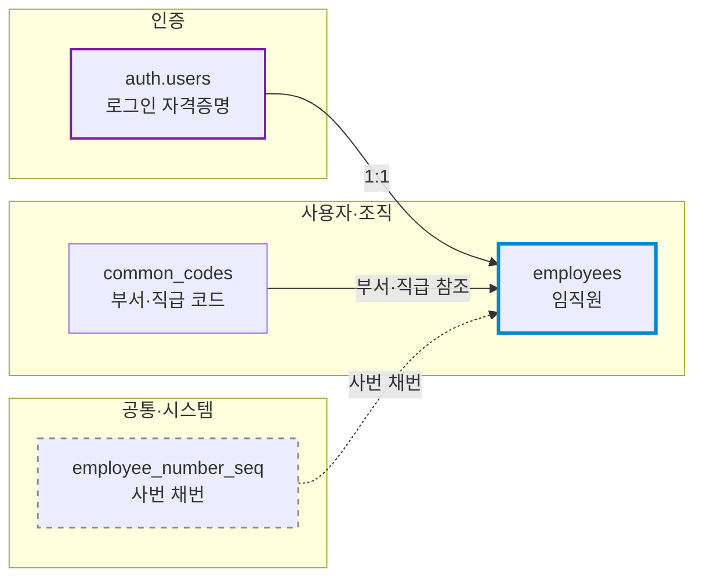
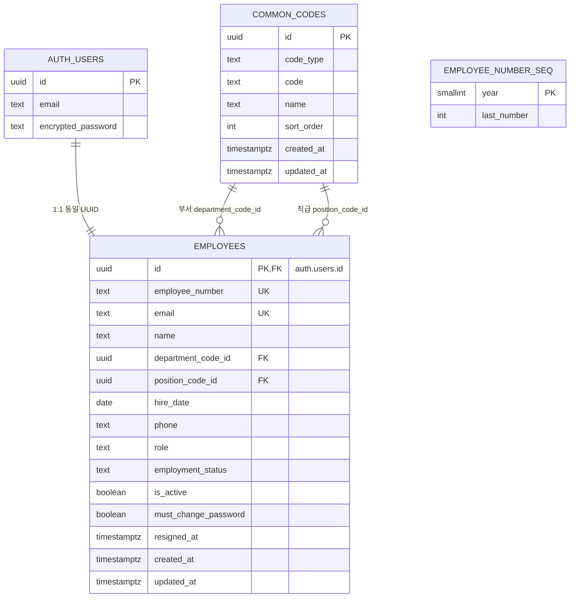
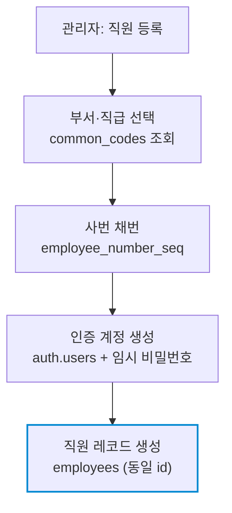

# 데이터베이스 ERD (Entity-Relationship Diagram)

> **대상**: 사내 ERP — 인증·인사 모듈 (MVP)
> **대상 DBMS**: PostgreSQL 17 (Supabase)
> **작성일**: 2026-05-30

본 문서는 데이터 모델의 구조를 3개 관점으로 시각화한다. 테이블 상세 명세는 database.md를 참조한다. employees가 모든 영역의 중심축이며, auth.users(인증)와 1:1로 연결된다.

---

## 1. 도메인 분류도

4개 테이블을 3개 영역으로 그룹화하여 전체 윤곽을 보여준다. 모든 관계가 employees로 모인다.

| 테두리 | 의미 |
|--------|------|
| 파란 굵은 선 (employees) | 모든 영역의 중심축 — 인사·계정 데이터의 단일 진실 공급원(SSOT) |
| 보라 선 (auth.users) | 인증 영역 — Supabase가 관리, employees와 1:1 |
| 회색 점선 (employee_number_seq) | FK 관계 없음 — 채번 함수가 참조하는 순번 카운터 |

---

## 2. 전체 ERD

4개 테이블의 컬럼 구성과 외래키 관계.

> employee_number_seq는 외래키 관계가 없는 독립 테이블로, 직원 등록 시 채번 함수가 참조하여 사번 순번을 발급한다.

---

## 3. 직원 등록 데이터 흐름

직원 등록 한 번에 인증 계정·인사 프로필·사번이 함께 생성되는 과정을 보여준다.

1. 관리자가 직원 등록 폼에서 부서·직급을 common_codes에서 선택
2. employee_number_seq로 입사연도 기준 사번 자동 채번 (예: 2026-0001)
3. auth.users에 인증 계정 + 임시 비밀번호 생성
4. 동일한 id로 employees 레코드 생성 — 2~4단계를 트랜잭션으로 원자 처리

---

## 4. 핵심 설계 원칙

| # | 원칙 | 효과 |
|---|------|------|
| 1 | employees를 단일 진실 공급원(SSOT)으로 운용 | 인사·계정 데이터가 employees.id로 일관 식별 |
| 2 | 인증을 auth.users로 위임 (1:1) | 비밀번호·세션을 Supabase가 관리, 애플리케이션 부담 최소화 |
| 3 | 부서·직급을 단일 common_codes로 정규화 | code_type으로 유형 구분, 코드 추가·변경이 employees에 영향 없음 |
| 4 | 재직상태(employment_status)와 계정활성(is_active) 분리 | 일시 비활성(재활성 가능)과 퇴사(비가역)를 구분 |
| 5 | 사번 채번 카운터(employee_number_seq) 분리 | 입사연도별 순번을 원자적으로 발급, 동시 등록 시 사번 충돌 방지 |
