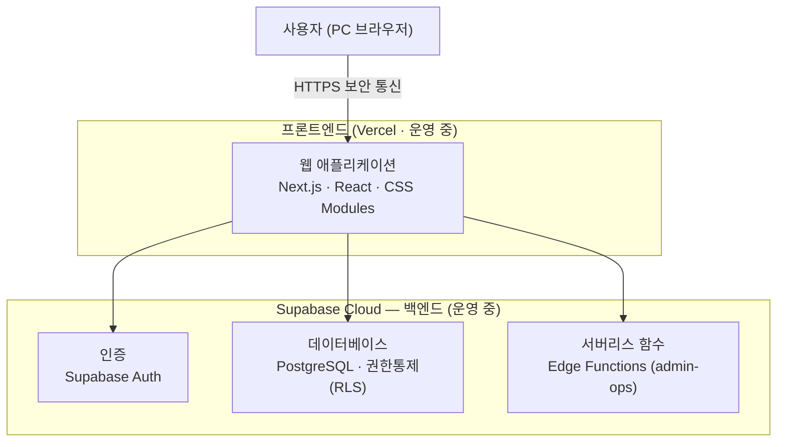

# 기술 스택 (Technology Stack)

> **대상**: 사내 ERP — 인증·인사 모듈
> **작성일**: 2026-05-30
> **수정일**: 2026-05-31 (현 구현 상태 반영)

관리형 클라우드 서비스 기반의 모던 웹 아키텍처로, **운영 부담을 최소화**하면서 **보안·성능·확장성**을 확보합니다. 별도의 서버 구축·운영 없이 검증된 글로벌 클라우드 인프라 위에서 안정적으로 운영됩니다.

---

## 시스템 구성

백엔드(인증·데이터·서버 로직)는 Supabase Cloud에서, 프론트엔드(Next.js)는 Vercel에서 운영 중입니다(https://jaepil-erp.vercel.app). 모든 통신은 HTTPS로 암호화됩니다. 배포 상세는 `deploy.md`를 참조하세요.

---

## 핵심 기술 스택

| 구분 | 선정 기술 | 역할 |
|------|----------|------|
| 프론트엔드 | **Next.js** (App Router) · **React** · **TypeScript** | 사용자 화면 구현 |
| 백엔드·DB | **Supabase** (PostgreSQL) | 인증·데이터베이스·서버리스 함수 통합 제공 |
| 인증 | **Supabase Auth** | 로그인, 세션 관리, 비밀번호 암호화 |
| 권한 통제 | **Row Level Security (RLS)** | 역할·본인별 데이터 접근 자동 제어 |
| 서버 로직 | **Supabase Edge Functions** (admin-ops) | 계정 생성·비밀번호 초기화 등 권한 작업(service_role) 처리 |
| 스타일링·UI | **CSS Modules** + 디자인 토큰(CSS 변수) | PC 화면 구성 (브라우저 정규화는 Tailwind CSS preflight 사용) |
| 호스팅 | **Supabase Cloud**(백엔드) · **Vercel**(프론트엔드) — 모두 운영 중 | 자동 SSL, CDN, 자동 백업 |

---

## 주요 특징

| 영역 | 내용 |
|------|------|
| 보안 | HTTPS 통신, 세션 탈취 방지, 데이터베이스 레벨 권한 강제(RLS)로 권한 외 데이터 접근 원천 차단 |
| 성능 | 페이지 로딩 3초 이내, 데이터 응답 평균 0.5초 이내 (목표) |
| 가용성 | 가용성 99.5% 이상(업무시간 기준), 일 1회 자동 백업·30일 보관 (목표) |
| 확장성 | 모듈형 구조로 회계·자산·프로젝트 등 추가 모듈 손쉽게 통합 |
| 운영 | 별도 서버 운영 인력 불요, 무중단 배포 |
| 디바이스 | PC (Chrome, Safari, Edge 등 모던 브라우저) |
