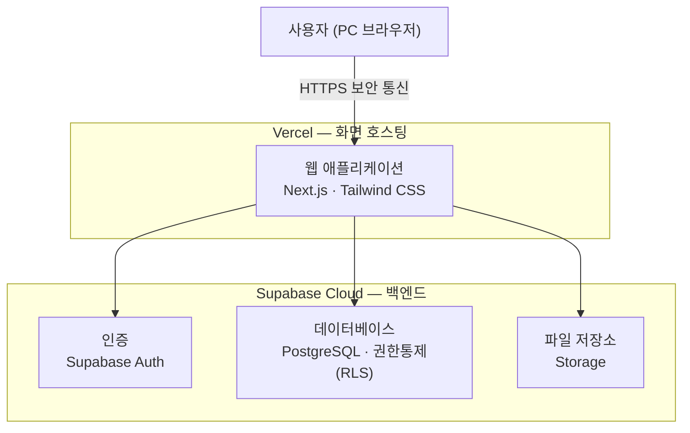

# 기술 스택 (Technology Stack)

> **대상**: 사내 ERP — 인증·인사 모듈
> **작성일**: 2026-05-30

관리형 클라우드 서비스 기반의 모던 웹 아키텍처로, **운영 부담을 최소화**하면서 **보안·성능·확장성**을 확보합니다. 별도의 서버 구축·운영 없이 검증된 글로벌 클라우드 인프라 위에서 안정적으로 운영됩니다.

---

## 시스템 구성

화면(프론트엔드)과 데이터(백엔드)를 분리하여 각각 글로벌 클라우드에서 호스팅하며, 모든 통신은 HTTPS로 암호화됩니다.

---

## 핵심 기술 스택

| 구분 | 선정 기술 | 역할 |
|------|----------|------|
| 프론트엔드 | **Next.js** + **TypeScript** | 사용자 화면 구현 |
| 백엔드·DB | **Supabase** (PostgreSQL) | 인증·데이터베이스·파일 저장소 통합 제공 |
| 인증 | **Supabase Auth** | 로그인, 세션 관리, 비밀번호 암호화 |
| 권한 통제 | **Row Level Security (RLS)** | 역할·본인별 데이터 접근 자동 제어 |
| 호스팅 | **Vercel** + **Supabase Cloud** | 자동 SSL, 글로벌 CDN, 자동 백업 |
| UI | **Tailwind CSS** | PC 화면 구성 |

---

## 주요 특징

| 영역 | 내용 |
|------|------|
| 보안 | HTTPS 통신, 세션 탈취 방지, 데이터베이스 레벨 권한 강제로 권한 외 데이터 접근 원천 차단 |
| 성능 | 페이지 로딩 3초 이내, 데이터 응답 평균 0.5초 이내 |
| 가용성 | 가용성 99.5% 이상(업무시간 기준), 일 1회 자동 백업·30일 보관 |
| 확장성 | 모듈형 구조로 회계·자산·프로젝트 등 추가 모듈 손쉽게 통합 |
| 운영 | 별도 서버 운영 인력 불요, 무중단 배포 |
| 디바이스 | PC (Chrome, Safari, Edge 등 모던 브라우저) |
