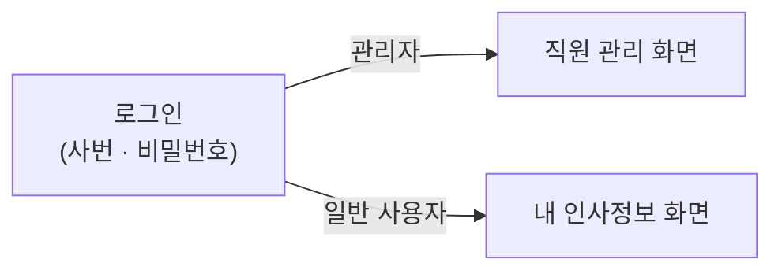
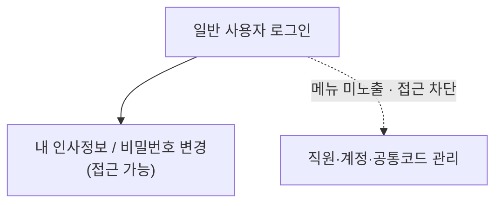

# 사용 가이드 (배포 환경 검증용)

> **대상**: 사내 ERP — 인증·인사 모듈 (MVP)
> **작성일**: 2026-05-31
> **목적**: 배포된 환경에서 핵심 기능을 **워크플로우별로 직접 검증**하기 위한 안내
> **접속 주소**: https://jaepil-erp.vercel.app
> **참조**: features.md (기능 정의), deploy.md (배포 현황)

---

## 시작하기 — 접속 & 로그인

1. https://jaepil-erp.vercel.app 접속 → 로그인 화면 표시
2. **사번 + 비밀번호**로 로그인 (비활성 계정은 로그인 거부됨)
3. 역할에 따라 첫 화면이 자동 분기됩니다.

> 화면 좌측 메뉴는 역할별로 다르게 노출됩니다. **관리자**: 직원 관리 · 계정 관리 · 공통 코드 · 내 인사정보 · 비밀번호 변경 / **일반 사용자**: 내 인사정보 · 비밀번호 변경.

검증을 마친 뒤에는 **로그아웃**으로 세션을 종료합니다. (FEAT-AUTH-02)

**검증 포인트**
- [ ] 로그아웃 시 세션이 종료되고 로그인 화면으로 돌아가는가
- [ ] 로그아웃 후 이전 화면으로 되돌아가 접근되지 않는가 (세션 무효화)

---

## 워크플로우 ① 직원 온보딩 (관리자)

신규 입사자를 등록하면 **사번 자동 채번**과 **로그인 계정 자동 생성**이 함께 처리되고, **임시 비밀번호**가 발급됩니다. (FEAT-CODE-01, FEAT-EMP-01, FEAT-ACCT-01)

**검증 포인트**
- [ ] 공통 코드(부서/직급)를 먼저 등록 → 직원 등록 폼의 선택 항목에 반영되는가
- [ ] 직원 등록 시 **사번이 자동 부여**되는가 (입사연도+순번)
- [ ] 등록 직후 **사번·임시 비밀번호**가 화면에 안내되는가
- [ ] 동일 유형 코드값 중복 등록이 차단되는가

---

## 워크플로우 ② 신규 직원 최초 로그인 (일반 사용자)

발급받은 사번·임시 비밀번호로 로그인한 뒤, 본인 비밀번호를 변경합니다. (FEAT-AUTH-01, FEAT-ACCT-05)

**검증 포인트**
- [ ] 발급된 임시 비밀번호로 로그인되는가
- [ ] **비밀번호 변경** 메뉴에서 본인 비밀번호를 바꿀 수 있는가
- [ ] 내 인사정보가 **읽기 전용**으로만 보이는가 (수정 불가)

---

## 워크플로우 ③ 계정·인사 관리 (관리자)

등록된 직원/계정을 운영합니다. (FEAT-ACCT-02·03·06, FEAT-EMP-02·03·05·06)

| 작업 | 메뉴 | 확인 내용 |
|------|------|----------|
| 역할 변경 | 계정 관리 | 일반 ↔ 관리자 전환. *마지막 관리자는 일반으로 변경 불가* |
| 계정 비활성/재활성 | 계정 관리 | 비활성 계정은 로그인 차단. *퇴사 계정은 재활성화 불가* |
| 비밀번호 초기화 | 계정 관리 | 새 임시 비밀번호 발급 |
| 직원 검색·필터 | 직원 관리 | 이름·사번·부서·재직상태로 검색 |
| 직원 정보 수정 | 직원 관리 | 인사정보 수정(*사번은 변경 불가*) |
| 퇴사 처리 | 직원 관리 | 재직→퇴사, 계정 자동 비활성화(*복직 불가*) |

**검증 포인트**
- [ ] 목록이 **무한 스크롤**(하단 도달 시 다음 건 로드)로 표시되는가
- [ ] 비활성화한 계정으로 로그인 시 **거부**되는가
- [ ] 퇴사 처리한 직원의 계정이 **재활성화되지 않는가**
- [ ] 참조 직원이 있는 공통 코드가 **삭제 차단**되는가

---

## 워크플로우 ④ 권한 통제 확인 (RBAC)

일반 사용자 계정으로 로그인해, 관리 기능 접근이 차단되는지 확인합니다. (FEAT-RBAC-01·02)

**검증 포인트**
- [ ] 일반 사용자에게 **관리 메뉴(직원/계정/공통코드)가 보이지 않는가**
- [ ] 일반 사용자가 타인의 인사정보·계정에 접근할 수 없는가

---

## 참고 — 세션 만료 정책

미동작 **1시간**(idle) 또는 로그인 후 **8시간**(absolute) 경과 시 세션이 자동 만료되어 재로그인을 요구합니다. (AUTH-3)
