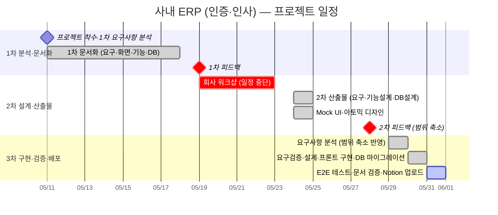

# 작업 분해 구조 (WBS) — 사내 ERP 인증·인사 모듈

> **프로젝트**: 사내 ERP — 인증·인사 모듈 (MVP)
> **수행 기간**: 2026-05-11 ~ 2026-05-31 (3주)
> **작성일**: 2026-05-31
> **추진 방식**: 피드백 2회(5/19·5/28) 기반 단계적 개발 범위 축소 — 3단계

---

## 1. 프로젝트 개요

| 항목 | 내용 |
|------|------|
| 프로젝트명 | 사내 ERP — 인증·인사 모듈 (MVP) |
| 수행 기간 | 2026-05-11 ~ 2026-05-31 (3주) |
| 추진 방식 | 피드백 2회(5/19·5/28) 기반 단계적 범위 축소 — 3단계 |
| 현재 현황 | 프론트엔드 구현·DB 마이그레이션·E2E 테스트·문서 검증 완료, **Notion 업로드 진행 중** |

---

## 2. 전체 일정 (Gantt)

---

## 3. WBS 작업 분해

| WBS | 단계 | 작업 | 기간 | 상태 |
|:---:|------|------|:----:|:----:|
| **1** | 1차 분석·문서화 | 프로젝트 착수·1차 요구사항 분석 | 5/11 | ✅ |
| 1.1 | | 1차 문서화 (요구·화면·기능·DB) | 5/11~5/18 | ✅ |
| 1.2 | | 1차 피드백 → 개발 범위 재설정 | 5/19 | ✅ |
| **2** | 2차 설계·산출물 | 회사 워크샵 (일정 중단) | 5/19~5/23 | ⏸️ |
| 2.1 | | 요구사항 분석·기능 설계·DB 설계 | 5/24~5/25 | ✅ |
| 2.2 | | Mock UI·아토믹 디자인 | 5/24~5/25 | ✅ |
| 2.3 | | 2차 피드백 → 개발 범위 추가 축소 | 5/28 | ✅ |
| **3** | 3차 구현·검증·배포 | 요구사항 분석 (범위 축소 반영) | 5/29 | ✅ |
| 3.1 | | 요구검증·기능/DB 설계·Mock UI·아토믹 | 5/30 | ✅ |
| 3.2 | | 프론트엔드 구현 | 5/30 | ✅ |
| 3.3 | | Supabase DB 마이그레이션 | 5/30 | ✅ |
| 3.4 | | E2E 테스트·문서 최종 검증 | 5/31 | ✅ |
| 3.5 | | Notion 업로드 | 5/31 | 🔄 |

> **범례** — ✅ 완료 · 🔄 진행 중 · ⏸️ 일정 중단(워크샵)
