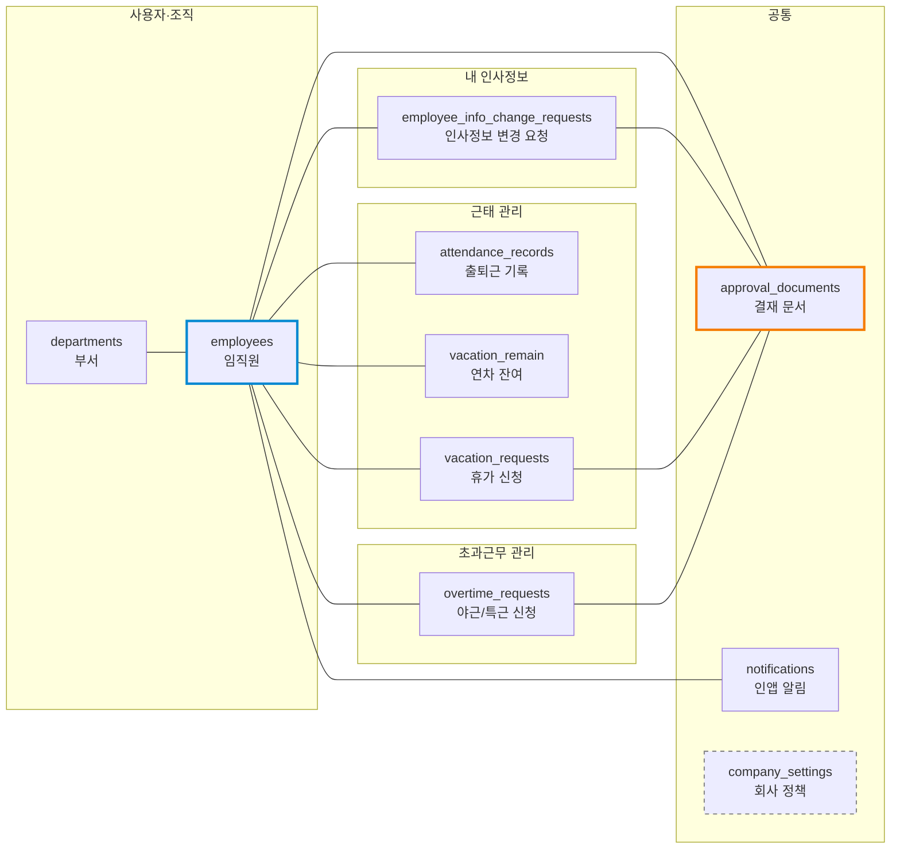
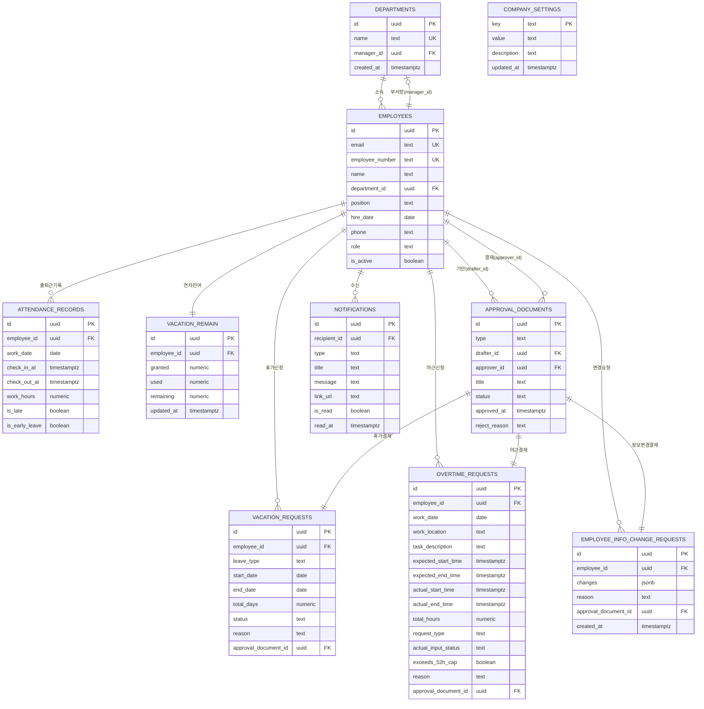
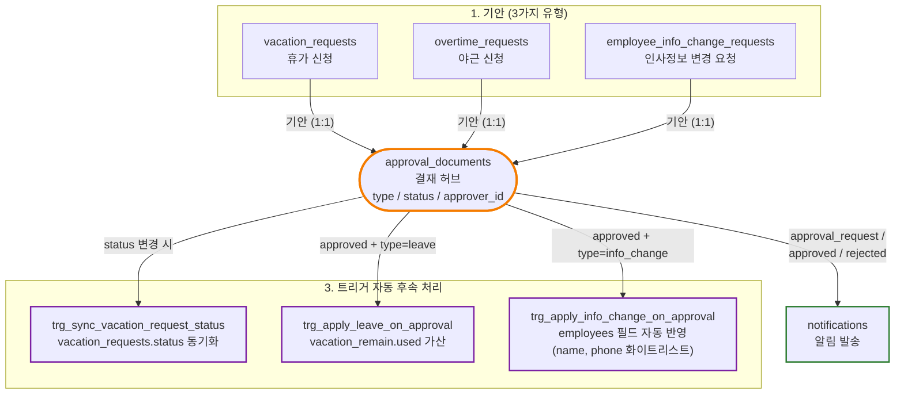

# 데이터베이스 ERD (Entity-Relationship Diagram)

> **대상**: 사내 ERP — 인사/근태 관리 모듈
> **작성일**: 2026-05-24

본 문서는 데이터 모델의 전체 구조를 3개 관점으로 시각화합니다.

---

## 1. 도메인 분류도

데이터를 5개 도메인으로 그룹화하여 시스템의 전체 윤곽을 한눈에 보여줍니다. employees가 모든 영역의 중심축이며, approval_documents가 결재 흐름의 허브입니다.



| 테두리 스타일 | 의미 |
|----------|------|
| 파란색 굵은 테두리 (employees) | 모든 도메인의 중심축 — 거의 모든 테이블이 직원과 연결 |
| 주황색 굵은 테두리 (approval_documents) | 결재 허브 — 3개 결재 유형(휴가·야근·인사변경)의 공통 진입점 |
| 회색 점선 (company_settings) | 관계 없는 정책 상수 저장소 (트리거가 참조) |

---

## 2. 전체 ERD

10개 테이블 전체의 컬럼 구성과 외래키 관계를 표현합니다.



---

## 3. 결재 허브 흐름도

approval_documents를 중심으로 3가지 결재 유형이 어떻게 기안되고, 승인 시 어떤 자동 후속 처리가 트리거되는지를 보여줍니다.



3가지 서로 다른 결재(휴가·야근·인사변경)가 **단일 결재 허브(approval_documents)** 를 공유합니다. 결재 상태가 변경되면 트리거가 자동으로 후속 액션(잔여 차감, 정보 반영, 상태 동기화, 알림 발송)을 수행하므로, 애플리케이션 코드의 실수가 데이터 정합성을 깨뜨리지 않습니다.

---

## 4. 핵심 설계 원칙

| # | 원칙 | 효과 |
|---|------|------|
| 1 | 도메인 분리 (5개 그룹) | 모듈 확장성 — 회계·자산·프로젝트 등 신규 모듈 통합 시 기존 영향 최소 |
| 2 | employees를 단일 진실 공급원(SSOT)으로 운용 | 인사정보·근태·결재 등 모든 데이터가 employees.id를 통해 일관 식별 |
| 3 | approval_documents 중앙 허브 구조 | 3가지 결재 유형을 단일 흐름으로 통합 → 결재함 UI·알림 로직 일원화 |
| 4 | 트리거 9개로 비즈니스 로직 DB 캡슐화 | 애플리케이션 버그가 발생해도 데이터 무결성 유지 (예: 결재 승인 시 잔여 자동 차감) |
| 5 | RLS Policy로 부서·역할 권한 자동 통제 | DB 레벨 안전망 — 코드 누락 시에도 부서 외 데이터 노출 차단 |
| 6 | company_settings로 정책 상수 외부화 | 정규 근무시간(09~18)·주 최대시간(52h, 근로기준법 제53조)·주 시작 요일(MONDAY) 등 회사 정책 변경 시 코드 수정 불필요. 트리거가 본 테이블 값 참조하여 하드 차단 임계값으로 사용 |

---

## 5. 핵심 데이터 흐름

### 5.1 휴가 신청 → 승인 → 잔여 차감

```
1. employee가 vacation_requests + approval_documents 동시 생성 (Server Action 트랜잭션)
2. departments.manager_id를 조회하여 approver_id 자동 지정
3. 부서장이 approval_documents.status를 'approved'로 변경
4. trg_sync_vacation_request_status → vacation_requests.status='approved' 동기화
5. trg_apply_leave_on_approval → vacation_remain.used += total_days 자동 가산
6. notifications에 'approval_approved' 알림 자동 생성
```

### 5.2 연차 자동 부여

```
매일 00:30 KST에 pg_cron이 실행:
- trg_grant_monthly_leave: 입사일의 day와 오늘 day가 같고 입사 1주년 미도래 직원에게 +1일
- trg_grant_yearly_leave: 입사일의 월·일과 오늘 월·일이 같고 입사 1주년 이상 직원에게 +15일
- 두 트리거가 같은 날 모두 발동되면 합산 +16일
- 부여 시 notifications에 'leave_granted' 알림 자동 발송
```

### 5.3 야근 사후 신청

```
1. 직원이 야근 종료 후 3일 이내에 overtime_requests 작성 (request_type='after', actual_*_time 입력)
2. CHECK 제약이 created_at - work_date ≤ 3일 검증
3. trg_calc_overtime_actual_hours가 total_hours 자동 계산 + exceeds_52h_cap 산출
4. `trg_enforce_overtime_52h_cap`이 주 합산(월~일) 한도 초과 시 RAISE EXCEPTION으로 저장 차단. UI는 cap-hit 종료 시각 안내 ("21:48까지만 등록 가능 — 추가 근무는 관리자 협의 필요")
5. 부서장 승인 시 동일 트리거가 재검증하여 사업주 위반을 야기할 승인을 강제 차단 (근로기준법 제53조)
```
