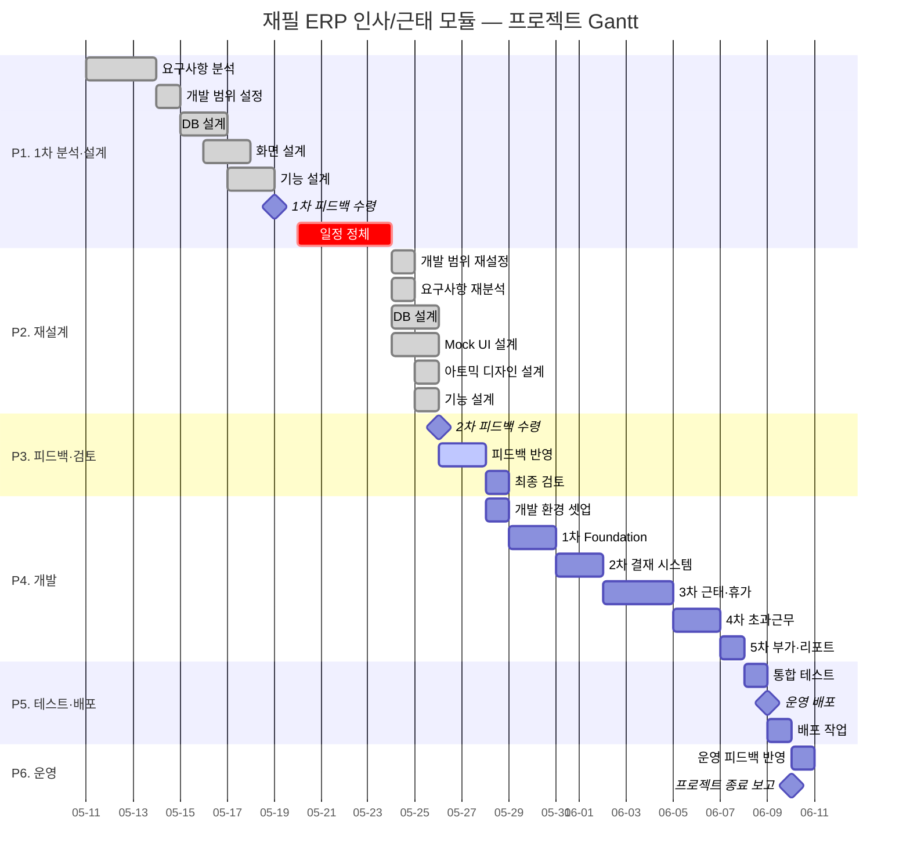

# 재필 ERP — WBS (Work Breakdown Structure)

> **범위**: 사내 ERP — 인사/근태 관리 모듈
> **프로젝트 기간**: 2026-05-11 ~ 2026-06-10 (총 31일)
> **개발 기간**: 2026-05-28 ~ 2026-06-10 (14일)
> **작성일**: 2026-05-25

---

## 📌 Notion 적용 가이드

본 WBS는 Notion `/table` 데이터베이스에 그대로 옮길 수 있도록 작성됐습니다.

### 1단계 — 노션에서 데이터베이스 생성

1. Notion 페이지에서 `/table` 입력 → **데이터베이스 - 인라인** 선택
2. 아래 **컬럼 속성**을 먼저 설정 (속성 유형이 맞아야 필터·정렬·색상이 정상 작동)

| 컬럼명 | 속성 유형 | 옵션값 (Select일 경우) |
|--------|-----------|------------------------|
| WBS ID | 제목(Title) | — |
| 작업명 | 텍스트(Text) | — |
| Phase | 선택(Select) | P1 분석/설계 · P2 재설계 · P3 검토 · P4 개발 · P5 테스트 · P6 배포 · P7 운영 |
| 유형 | 선택(Select) | Epic · Story · Task |
| 시작일 | 날짜(Date) | — |
| 종료일 | 날짜(Date) | — |
| 일수 | 숫자(Number) | — |
| 상태 | 선택(Select) | ✅ 완료 · 🔄 진행중 · ⏳ 예정 · ⏸ 보류 |
| 우선순위 | 선택(Select) | 🔴 High · 🟡 Medium · 🟢 Low |
| 산출물 | 텍스트(Text) | — |
| 비고 | 텍스트(Text) | — |

### 2단계 — WBS 데이터 붙여넣기

- 아래의 **메인 WBS Table**을 통째로 복사
- 노션 데이터베이스 첫 행에 붙여넣기 → 자동으로 행 생성
- (안 되면) Markdown 표 그대로 paste → 우측 상단 `...` → **데이터베이스로 전환** → 컬럼 속성 재설정

### 3단계 — 뷰(View) 추가로 Jira 가독성 확보

| 뷰 이름 | 유형 | 설정 |
|---------|------|------|
| 📋 전체 목록 | 표(Table) | 기본 — 모든 컬럼 표시 |
| 📅 타임라인 | 타임라인(Timeline) | 시작일·종료일 기준 — Gantt 효과 |
| 📌 칸반 | 보드(Board) | "상태" 컬럼으로 그룹화 |
| 🎯 Phase별 | 표(Table) | "Phase"로 그룹화 + 우선순위 정렬 |

---

## 🗓 마일스톤 요약

| 마일스톤 | 일자 | 설명 |
|----------|------|------|
| M0. 프로젝트 착수 | 2026-05-11 | 1차 요구사항 분석 시작 |
| M1. 1차 설계 완료 | 2026-05-18 | DB/화면/기능 설계 1차안 완성 |
| M2. 1차 피드백 | 2026-05-19 | 상사 피드백 수령 |
| M3. 재설계 완료 | 2026-05-25 | 범위 재설정 + Mock UI + 아토믹 디자인 완성 |
| M4. 2차 피드백 | 2026-05-26 | 상사 컨펌 수령 |
| M5. 최종 설계 확정 | 2026-05-28 | 피드백 반영 + 최종 검토 통과 |
| M6. 개발 착수 | 2026-05-28 | Foundation(1차) 개발 시작 |
| M7. MVP 완성 | 2026-06-07 | 1~5차 기능 개발 완료 |
| M8. 운영 배포 | 2026-06-09 | Vercel + Supabase 운영 적용 |
| M9. 프로젝트 종료 | 2026-06-10 | 운영 피드백 반영 + 종료 보고 |

---

## 📊 Gantt 차트 (Mermaid)

> Notion 코드 블록 언어를 `mermaid`로 지정하면 렌더링됩니다.

---

## 📋 메인 WBS Table

| WBS ID | 작업명 | Phase | 유형 | 시작일 | 종료일 | 일수 | 상태 | 우선순위 | 산출물 | 비고 |
|--------|--------|-------|------|--------|--------|------|------|----------|--------|------|
| 1 | 1차 요구사항 분석 및 설계 | P1 분석/설계 | Epic | 2026-05-11 | 2026-05-18 | 8 | ✅ 완료 | 🔴 High | 1차 설계 산출물 일체 | — |
| 1.1 | 요구사항 분석 | P1 분석/설계 | Story | 2026-05-11 | 2026-05-13 | 3 | ✅ 완료 | 🔴 High | requirements.md (1차) | 26 REQ 도출 |
| 1.2 | 개발 범위 설정 | P1 분석/설계 | Story | 2026-05-14 | 2026-05-14 | 1 | ✅ 완료 | 🔴 High | 개발 범위 정의서 (1차) | — |
| 1.3 | DB 설계 | P1 분석/설계 | Story | 2026-05-15 | 2026-05-16 | 2 | ✅ 완료 | 🔴 High | database.md (1차) | 테이블·관계 정의 |
| 1.4 | 화면 설계 | P1 분석/설계 | Story | 2026-05-16 | 2026-05-17 | 2 | ✅ 완료 | 🔴 High | 와이어프레임 (1차) | — |
| 1.5 | 기능 설계 | P1 분석/설계 | Story | 2026-05-17 | 2026-05-18 | 2 | ✅ 완료 | 🔴 High | features.md (1차) | 37 FEAT |
| 1.6 | 1차 피드백 수령 | P1 분석/설계 | Task | 2026-05-19 | 2026-05-19 | 1 | ✅ 완료 | 🔴 High | 피드백 노트 | 상사 컨펌 |
| 1.7 | 일정 정체 (외부 사정) | P1 분석/설계 | Task | 2026-05-20 | 2026-05-23 | 4 | ⏸ 보류 | 🟢 Low | — | 미진행 구간 |
| 2 | 재설계 (범위/요건/DB/UI) | P2 재설계 | Epic | 2026-05-24 | 2026-05-25 | 2 | ✅ 완료 | 🔴 High | 재설계 산출물 일체 | 1차 피드백 반영 |
| 2.1 | 개발 범위 재설정 | P2 재설계 | Story | 2026-05-24 | 2026-05-24 | 1 | ✅ 완료 | 🔴 High | 개발 범위 정의서 (2차) | 인사/근태 모듈 한정 |
| 2.2 | 요구사항 재분석 | P2 재설계 | Story | 2026-05-24 | 2026-05-24 | 1 | ✅ 완료 | 🔴 High | requirements.md | REQ-HR/AT/OT/CM |
| 2.3 | DB 설계 | P2 재설계 | Story | 2026-05-24 | 2026-05-25 | 2 | ✅ 완료 | 🔴 High | database.md + erd.md | 10 테이블 + 9 트리거 |
| 2.4 | Mock UI 설계 | P2 재설계 | Story | 2026-05-24 | 2026-05-25 | 2 | ✅ 완료 | 🔴 High | Figma Pages 11종 | 풀빌드 11/11 |
| 2.5 | 아토믹 디자인 시스템 설계 | P2 재설계 | Story | 2026-05-25 | 2026-05-25 | 1 | ✅ 완료 | 🔴 High | design.md + Figma | Atom 17·Mol 15·Org 15·Tpl 5 |
| 2.6 | 기능 설계 | P2 재설계 | Story | 2026-05-25 | 2026-05-25 | 1 | ✅ 완료 | 🔴 High | features.md | 37 FEAT, 우선순위 1~5차 |
| 3 | 2차 피드백 및 최종 검토 | P3 검토 | Epic | 2026-05-26 | 2026-05-28 | 3 | 🔄 진행중 | 🔴 High | 확정된 설계 문서 | 개발 착수 전 게이트 |
| 3.1 | 2차 피드백 수령 | P3 검토 | Task | 2026-05-26 | 2026-05-26 | 1 | ⏳ 예정 | 🔴 High | 피드백 노트 | 상사 컨펌 (디자인/구조) |
| 3.2 | 피드백 반영 | P3 검토 | Story | 2026-05-26 | 2026-05-27 | 2 | ⏳ 예정 | 🔴 High | 수정된 설계 문서 | 1~2 이터레이션 |
| 3.3 | 최종 설계 검토 | P3 검토 | Task | 2026-05-28 | 2026-05-28 | 1 | ⏳ 예정 | 🔴 High | 검토 통과 확인서 | 개발 착수 게이트 |
| 4 | 개발 (1~5차) | P4 개발 | Epic | 2026-05-28 | 2026-06-07 | 11 | ⏳ 예정 | 🔴 High | 동작 가능한 MVP | 우선순위 단계별 |
| 4.0 | 개발 환경 셋업 | P4 개발 | Story | 2026-05-28 | 2026-05-28 | 1 | ⏳ 예정 | 🔴 High | 셋업 완료 환경 | — |
| 4.0.1 | Next.js 16 프로젝트 init | P4 개발 | Task | 2026-05-28 | 2026-05-28 | 1 | ⏳ 예정 | 🔴 High | repo 초기 커밋 | `npx create-next-app` |
| 4.0.2 | Supabase 프로젝트 + 스키마 적용 | P4 개발 | Task | 2026-05-28 | 2026-05-28 | 1 | ⏳ 예정 | 🔴 High | Supabase 마이그레이션 | database.md → SQL |
| 4.0.3 | Vercel 초기 배포 + 환경변수 | P4 개발 | Task | 2026-05-28 | 2026-05-28 | 1 | ⏳ 예정 | 🔴 High | dev URL 가동 | Supabase URL/anon key |
| 4.0.4 | Tailwind + shadcn/ui 설정 | P4 개발 | Task | 2026-05-28 | 2026-05-28 | 1 | ⏳ 예정 | 🔴 High | 17 Atoms 매핑 | design.md 부록 A |
| 4.1 | 1차 — 인증·권한·인프라 (Foundation) | P4 개발 | Story | 2026-05-29 | 2026-05-30 | 2 | ⏳ 예정 | 🔴 High | 로그인·RLS·레이아웃 | FEAT-CM-01~04·11, FEAT-HR-01 |
| 4.1.1 | Supabase Auth 로그인/세션 | P4 개발 | Task | 2026-05-29 | 2026-05-29 | 1 | ⏳ 예정 | 🔴 High | 로그인 화면 동작 | FEAT-CM-01·02·03 |
| 4.1.2 | 사번 → 이메일 매핑 로직 | P4 개발 | Task | 2026-05-29 | 2026-05-29 | 1 | ⏳ 예정 | 🔴 High | Server Action | FEAT-CM-01 |
| 4.1.3 | RLS Policy 설정 | P4 개발 | Task | 2026-05-29 | 2026-05-30 | 2 | ⏳ 예정 | 🔴 High | 전 테이블 RLS 적용 | FEAT-CM-04 |
| 4.1.4 | AppLayout (반응형 1280px) | P4 개발 | Task | 2026-05-30 | 2026-05-30 | 1 | ⏳ 예정 | 🟡 Medium | 공통 레이아웃 | FEAT-CM-11 |
| 4.1.5 | 본인 인사정보 조회 화면 | P4 개발 | Task | 2026-05-30 | 2026-05-30 | 1 | ⏳ 예정 | 🟡 Medium | /me 페이지 | FEAT-HR-01 |
| 4.2 | 2차 — 결재 시스템 | P4 개발 | Story | 2026-05-31 | 2026-06-01 | 2 | ⏳ 예정 | 🔴 High | 결재 기안·승인·반려 | FEAT-CM-05~10 |
| 4.2.1 | 결재 기안 폼 | P4 개발 | Task | 2026-05-31 | 2026-05-31 | 1 | ⏳ 예정 | 🔴 High | 휴가/야근/인사 폼 | FEAT-CM-05 |
| 4.2.2 | 결재 승인·반려 | P4 개발 | Task | 2026-05-31 | 2026-06-01 | 2 | ⏳ 예정 | 🔴 High | 결재자 액션 | FEAT-CM-06·07 |
| 4.2.3 | 결재함 (탭별 조회) | P4 개발 | Task | 2026-06-01 | 2026-06-01 | 1 | ⏳ 예정 | 🟡 Medium | 대기/완료/반려 탭 | FEAT-CM-08 |
| 4.2.4 | 인앱 알림 (벨 + 드롭다운) | P4 개발 | Task | 2026-06-01 | 2026-06-01 | 1 | ⏳ 예정 | 🟡 Medium | 알림 컴포넌트 | FEAT-CM-09·10 |
| 4.2.5 | 결재자 자동 지정 로직 | P4 개발 | Task | 2026-06-01 | 2026-06-01 | 1 | ⏳ 예정 | 🟡 Medium | 라우팅 함수 | database.md 비즈 규칙 |
| 4.3 | 3차 — 근태·휴가 | P4 개발 | Story | 2026-06-02 | 2026-06-04 | 3 | ⏳ 예정 | 🔴 High | 출퇴근·휴가·캘린더 | FEAT-AT-01~13 |
| 4.3.1 | 출근/퇴근 체크인 | P4 개발 | Task | 2026-06-02 | 2026-06-02 | 1 | ⏳ 예정 | 🔴 High | 체크인 동작 | FEAT-AT-01·02 |
| 4.3.2 | 일별·월별 출퇴근 조회 | P4 개발 | Task | 2026-06-02 | 2026-06-02 | 1 | ⏳ 예정 | 🟡 Medium | 리스트·캘린더 뷰 | FEAT-AT-03·04 |
| 4.3.3 | 휴가 신청 폼 | P4 개발 | Task | 2026-06-03 | 2026-06-03 | 1 | ⏳ 예정 | 🔴 High | 휴가 기안 | FEAT-AT-07 |
| 4.3.4 | 휴가 승인 시 잔여 차감 트리거 | P4 개발 | Task | 2026-06-03 | 2026-06-03 | 1 | ⏳ 예정 | 🔴 High | DB 트리거 | FEAT-AT-08 |
| 4.3.5 | 잔여 연차 위젯 | P4 개발 | Task | 2026-06-03 | 2026-06-03 | 1 | ⏳ 예정 | 🟡 Medium | 대시보드 위젯 | FEAT-AT-09 |
| 4.3.6 | 휴가 이력 조회 | P4 개발 | Task | 2026-06-03 | 2026-06-03 | 1 | ⏳ 예정 | 🟡 Medium | 이력 리스트 | FEAT-AT-10 |
| 4.3.7 | 부서 휴가 캘린더 | P4 개발 | Task | 2026-06-04 | 2026-06-04 | 1 | ⏳ 예정 | 🟡 Medium | 월간 캘린더 | FEAT-AT-11 |
| 4.3.8 | 연차 자동 부여 (pg_cron) | P4 개발 | Task | 2026-06-04 | 2026-06-04 | 1 | ⏳ 예정 | 🟡 Medium | cron 함수 | FEAT-AT-12·13 |
| 4.4 | 4차 — 초과근무 | P4 개발 | Story | 2026-06-05 | 2026-06-06 | 2 | ⏳ 예정 | 🔴 High | 야근 신청·집계·차단 | FEAT-OT-01~09 |
| 4.4.1 | 야근 사전/사후 신청 폼 | P4 개발 | Task | 2026-06-05 | 2026-06-05 | 1 | ⏳ 예정 | 🔴 High | 야근 기안 | FEAT-OT-01·02 |
| 4.4.2 | 야근 신청 결재 | P4 개발 | Task | 2026-06-05 | 2026-06-05 | 1 | ⏳ 예정 | 🔴 High | 부서장 결재 | FEAT-OT-03 |
| 4.4.3 | 주 52시간 한도 강제 차단 트리거 | P4 개발 | Task | 2026-06-05 | 2026-06-06 | 2 | ⏳ 예정 | 🔴 High | trg_enforce_*_52h_cap | FEAT-OT-04 (법정 필수) |
| 4.4.4 | 사전 검증 RPC + 클라이언트 검증 | P4 개발 | Task | 2026-06-06 | 2026-06-06 | 1 | ⏳ 예정 | 🔴 High | validate_weekly_hours | FEAT-OT-04 |
| 4.4.5 | 야근 시간 집계 트리거 | P4 개발 | Task | 2026-06-06 | 2026-06-06 | 1 | ⏳ 예정 | 🟡 Medium | 일/주/월 집계 | FEAT-OT-05 |
| 4.4.6 | 야근 누적 위젯 (게이지) | P4 개발 | Task | 2026-06-06 | 2026-06-06 | 1 | ⏳ 예정 | 🟡 Medium | 52h 게이지 | FEAT-OT-06 |
| 4.4.7 | 야근 실제 시간 입력 | P4 개발 | Task | 2026-06-06 | 2026-06-06 | 1 | ⏳ 예정 | 🟡 Medium | 확정 입력 화면 | FEAT-OT-09 |
| 4.5 | 5차 — 부가 기능·리포트 | P4 개발 | Story | 2026-06-07 | 2026-06-07 | 1 | ⏳ 예정 | 🟢 Low | 인사변경·리포트 | FEAT-HR-02~04·AT-05·06·OT-07·08 |
| 4.5.1 | 인사정보 변경 요청 + 반영 트리거 | P4 개발 | Task | 2026-06-07 | 2026-06-07 | 1 | ⏳ 예정 | 🟢 Low | 인사 변경 흐름 | FEAT-HR-02·03·04 |
| 4.5.2 | 부서 출퇴근 현황 조회 | P4 개발 | Task | 2026-06-07 | 2026-06-07 | 1 | ⏳ 예정 | 🟢 Low | 부서장 화면 | FEAT-AT-05 |
| 4.5.3 | 지각/조퇴 색상 표시 | P4 개발 | Task | 2026-06-07 | 2026-06-07 | 1 | ⏳ 예정 | 🟢 Low | 자동 식별 | FEAT-AT-06 |
| 4.5.4 | 부서별·전사 야근 리포트 | P4 개발 | Task | 2026-06-07 | 2026-06-07 | 1 | ⏳ 예정 | 🟢 Low | 통계 리포트 | FEAT-OT-07·08 |
| 5 | 통합 테스트 | P5 테스트 | Epic | 2026-06-08 | 2026-06-08 | 1 | ⏳ 예정 | 🔴 High | 테스트 리포트 | 핵심 시나리오 검증 |
| 5.1 | 핵심 결재 시나리오 (휴가/야근/인사) E2E | P5 테스트 | Task | 2026-06-08 | 2026-06-08 | 1 | ⏳ 예정 | 🔴 High | 시나리오 통과 | — |
| 5.2 | RLS·트리거 동작 검증 | P5 테스트 | Task | 2026-06-08 | 2026-06-08 | 1 | ⏳ 예정 | 🔴 High | 권한·무결성 검증 | 부서/역할별 |
| 5.3 | 주 52h 차단 시나리오 검증 | P5 테스트 | Task | 2026-06-08 | 2026-06-08 | 1 | ⏳ 예정 | 🔴 High | 경계값 테스트 | 법정 필수 |
| 5.4 | 버그 픽스 | P5 테스트 | Task | 2026-06-08 | 2026-06-08 | 1 | ⏳ 예정 | 🟡 Medium | 결함 0건 목표 | — |
| 6 | 운영 배포 | P6 배포 | Epic | 2026-06-09 | 2026-06-09 | 1 | ⏳ 예정 | 🔴 High | 운영 환경 가동 | — |
| 6.1 | Vercel + Supabase 운영 배포 | P6 배포 | Task | 2026-06-09 | 2026-06-09 | 1 | ⏳ 예정 | 🔴 High | 운영 URL | 도메인·환경변수 확정 |
| 6.2 | 운영 스모크 테스트 | P6 배포 | Task | 2026-06-09 | 2026-06-09 | 1 | ⏳ 예정 | 🔴 High | Health check OK | — |
| 6.3 | DB 접근 가이드 공유 | P6 배포 | Task | 2026-06-09 | 2026-06-09 | 1 | ⏳ 예정 | 🟡 Medium | 접속 가이드 문서 | Supabase URL/key |
| 7 | 운영 피드백 반영 및 종료 | P7 운영 | Epic | 2026-06-10 | 2026-06-10 | 1 | ⏳ 예정 | 🟡 Medium | 종료 보고서 | — |
| 7.1 | 사용자 피드백 수렴 | P7 운영 | Task | 2026-06-10 | 2026-06-10 | 1 | ⏳ 예정 | 🟡 Medium | 피드백 노트 | — |
| 7.2 | 핫픽스 / 마이너 개선 | P7 운영 | Task | 2026-06-10 | 2026-06-10 | 1 | ⏳ 예정 | 🟡 Medium | 패치 배포 | — |
| 7.3 | 프로젝트 종료 보고 | P7 운영 | Task | 2026-06-10 | 2026-06-10 | 1 | ⏳ 예정 | 🟢 Low | 종료 보고서 | 회고 포함 |

---

## 🔗 의존성 관계 요약

| 선행 작업 | 후행 작업 | 비고 |
|-----------|-----------|------|
| 3.3 최종 검토 통과 | 4.0 개발 환경 셋업 | 설계 확정 게이트 |
| 4.0 개발 환경 셋업 | 4.1 Foundation | 인프라 선행 필수 |
| 4.1 Foundation (인증·RLS) | 4.2 결재 시스템 | 권한 기반 후속 모든 흐름 |
| 4.2 결재 시스템 | 4.3 근태·휴가 / 4.4 초과근무 | 결재 기능 위에 도메인 흐름 구축 |
| 4.3 / 4.4 | 4.5 부가 기능 | 핵심 모듈 후 부가 기능 |
| 4.5 개발 완료 | 5 통합 테스트 | MVP 완성 후 검증 |
| 5 통합 테스트 통과 | 6 운영 배포 | 품질 게이트 |
| 6 운영 배포 | 7 피드백 반영 | 실사용자 피드백 후 마무리 |

---

## 📑 컬럼 정의

| 컬럼 | 설명 |
|------|------|
| WBS ID | 계층형 식별자 (1 → 1.1 → 1.1.1). Notion 첫 컬럼(Title)에 매핑 |
| 작업명 | 작업의 짧은 명칭 |
| Phase | 대단위 페이즈 (P1~P7). Notion Select 컬럼으로 색상 부여 |
| 유형 | Epic(대), Story(중), Task(소). Jira와 동일한 위계 |
| 시작일 / 종료일 | 작업 수행 기간. Notion Date 컬럼 → 타임라인 뷰 연결 |
| 일수 | 작업 소요일 (영업일/총일 혼용 — 본 프로젝트는 단기간이라 총일 기준) |
| 상태 | ✅ 완료 / 🔄 진행중 / ⏳ 예정 / ⏸ 보류 |
| 우선순위 | 🔴 High (Must) / 🟡 Medium (Should) / 🟢 Low (Could) |
| 산출물 | 작업 완료 시 인도 가능한 결과물 |
| 비고 | 관련 FEAT/REQ ID, 의존성, 특이사항 |

---

## ✅ 진행 현황 스냅샷 (2026-05-25 기준)

| 구분 | 건수 |
|------|------|
| 완료 (✅) | 14건 |
| 진행중 (🔄) | 1건 |
| 예정 (⏳) | 46건 |
| 보류 (⏸) | 1건 |
| **합계** | **62건** |

| Phase | 완료율 |
|-------|--------|
| P1 분석/설계 | 100% (정체 구간 포함) |
| P2 재설계 | 100% |
| P3 검토 | 0% (5/26 시작 예정) |
| P4 개발 | 0% (5/28 시작 예정) |
| P5 테스트 | 0% |
| P6 배포 | 0% |
| P7 운영 | 0% |
